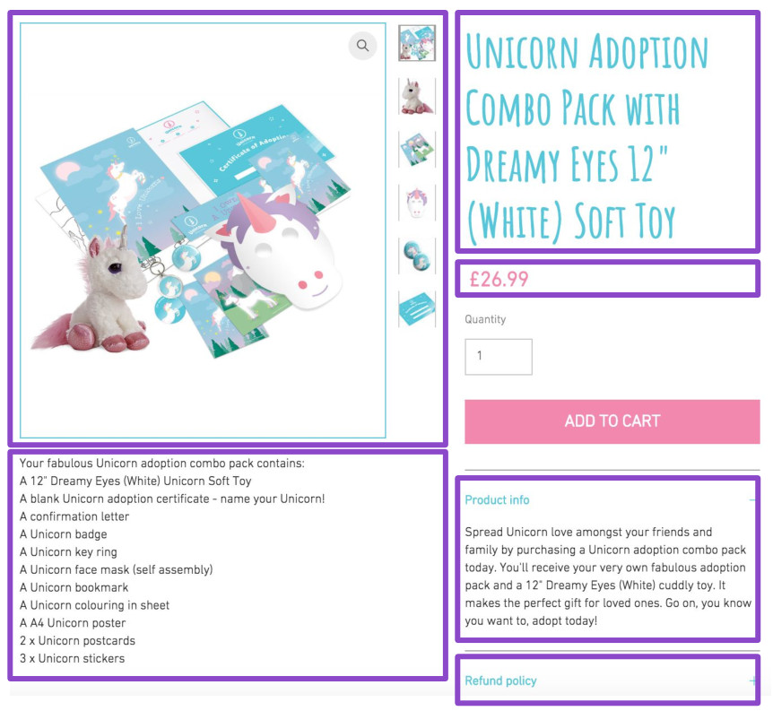
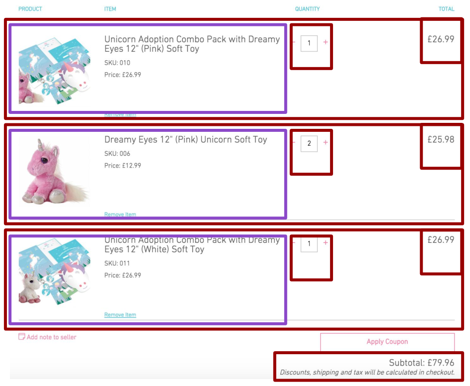

# Online store

## Product view



`/api/products/:id`

```json
{
  "id": "59eb83c0040fa80b29938e3f",
  "title": "Combo Pack with Dreamy Eyes 12\" (Pink) Soft Toy",
  "price": 26.99,
  "description": "Spread Unicorn love amongst your friends and family by purchasing a Unicorn adoption combo pack today. You'll receive your very own fabulous adoption pack and a 12\" Dreamy Eyes (Pink) cuddly toy. It makes the perfect gift for loved ones. Go on, you know you want to, adopt today!",
  "sku": "010",
  "images": [
    "http://localhost:8080/img/918d8d4cc83d4e5f8680ca4edfd5b6b2.jpg",
    "http://localhost:8080/img/f343889c0bb94965845e65d3f39f8798.jpg",
    "http://localhost:8080/img/dd55129473e04f489806db0dc6468dd9.jpg",
    "http://localhost:8080/img/64eba4524a1f4d5d9f1687a815795643.jpg",
    "http://localhost:8080/img/5727549e9131440dbb3cd707dce45d0f.jpg",
    "http://localhost:8080/img/28ae9369ec3c442dbfe6901434ad15af.jpg"
  ]
}
```

---------------------

## Product List view


`/api/products`

```json
{
  "items": [
    {
      "id": "59eb83c0040fa80b29938e3f",
      "title": "Combo Pack with Dreamy Eyes 12\" (Pink) Soft Toy",
      "price": 26.99,
      "description": "Spread Unicorn love amongst your friends and family by purchasing a Unicorn adoption combo pack today. You'll receive your very own fabulous adoption pack and a 12\" Dreamy Eyes (Pink) cuddly toy. It makes the perfect gift for loved ones. Go on, you know you want to, adopt today!",
      "sku": "010",
      "images": [
        "http://localhost:8080/img/918d8d4cc83d4e5f8680ca4edfd5b6b2.jpg",
        "http://localhost:8080/img/f343889c0bb94965845e65d3f39f8798.jpg",
        "http://localhost:8080/img/dd55129473e04f489806db0dc6468dd9.jpg",
        "http://localhost:8080/img/64eba4524a1f4d5d9f1687a815795643.jpg",
        "http://localhost:8080/img/5727549e9131440dbb3cd707dce45d0f.jpg",
        "http://localhost:8080/img/28ae9369ec3c442dbfe6901434ad15af.jpg"
      ]
    }
  ]
}
```

```json
{
  "items": [
    {
      "id": "59eb83c0040fa80b29938e3f",
      "title": "Combo Pack with Dreamy Eyes 12\" (Pink) Soft Toy",
      "price": 26.99,
      "images": "http://localhost:8080/img/918d8d4cc83d4e5f8680ca4edfd5b6b2.jpg"
    }
  ]
}
```

----------------------

## Cart view



`/api/carts/:id`

### Classic REST

```json
{
  "id": 1,
  "items": [
    {
      "product": "/products/59eb83c0040fa80b29938e3f",
      "quantity": 1,
      "total": 26.99
    },
    {
      "product": "/products/59eb83c0040fa80b29938e40",
      "quantity": 2,
      "total": 25.98
    },
    {
      "product": "/products/59eb88bd040fa8125aa9c400",
      "quantity": 1,
      "total": 26.99
    }
  ],
  "subTotal": 79.96
}
```

`/api/carts/:id?projection=with-products`

```json
{
  "id": 1,
  "items": [
    {
      "product": {
        "id": "59eb83c0040fa80b29938e3f",
        "title": "Combo Pack with Dreamy Eyes 12\" (Pink) Soft Toy",
        "price": 26.99,
        "images": "http://localhost:8080/img/918d8d4cc83d4e5f8680ca4edfd5b6b2.jpg",
        "sku": "010"
      },
      "quantity": 1,
      "total": 26.99
    },
    {
      "product": {
        "id": "59eb88bd040fa8125aa9c400",
        "title": "Combo Pack with Dreamy Eyes 12\" (Pink) Soft Toy",
        "price": 26.99,
        "images": "http://localhost:8080/img/918d8d4cc83d4e5f8680ca4edfd5b6b2.jpg",
        "sku": "011"
      },
      "quantity": 2,
      "total": 25.98
    },
    {
      "product": {
        "id": "59eb88bd040fa8125aa9c400",
        "title": "Combo Pack with Dreamy Eyes 12\" (Pink) Soft Toy",
        "price": 26.99,
        "images": "http://localhost:8080/img/918d8d4cc83d4e5f8680ca4edfd5b6b2.jpg",
        "sku": "012"
      },
      "quantity": 1,
      "total": 26.99
    }
  ],
  "subTotal": 79.96
}
```
-------------------
# GRAPHQL

```graphql
type Query {
    products: [Product]
    product(id: String): Product
    cart: Cart
}

type Product {
    id: String
    title: String
    description: String
    price: Float
    image: String
    images: [String]
    sku: String @deprecated
}

type Cart {
    subtotal: Float
    items: [CartItem]
}

type CartItem {
    total: Float
    qnt: Int
    product: Product
}

```